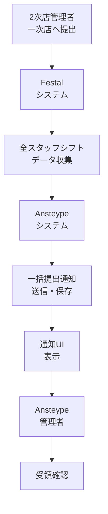
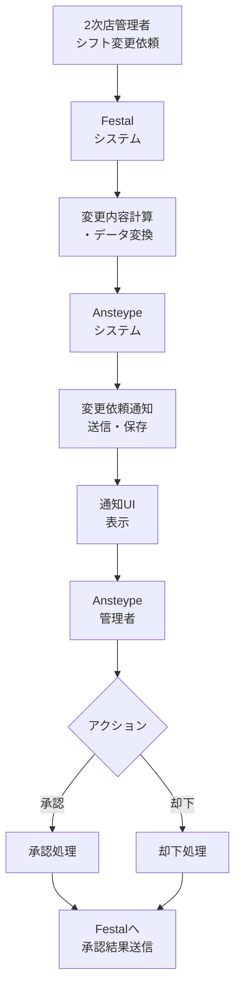

# 修正内容まとめ - Ansteype側通知システム仕様書

## 概要

ユーザーからのフィードバックに基づき、以下の重要な修正を行いました：

1. **要望セルの仕様修正**: テキスト入力から整数入力のみに変更
2. **通知種別の整理**: 
   - ❌ **削除**: 個別スタッフのシフト提出通知
   - ✅ **追加**: 2次店管理者の一括シフト提出通知
   - ✅ **維持**: 2次店管理者のシフト変更依頼通知
3. **承認者コメント構造の変更**: スタッフ単位から依頼全体に変更
4. **ステータス名称の変更**: 「一部承認済み」→「部分承認」

---

## 1. 要望セルの修正詳細

### 1.1 変更前（誤った仕様）
- 要望セル: テキスト入力フィールド
- データ型: `string`
- 入力例: "平日希望"、"土日出勤可能"、"夜勤希望"

### 1.2 変更後（正しい仕様）
- 要望セル: 整数入力フィールド（単一の数値）
- データ型: `number` (API送信時は`string`として格納)
- 入力例: `15`, `20`, `18`
- フィールド名: `request`（単一フィールド）

### 1.3 実装への影響

**データ型定義の修正**:
```typescript
// 修正前
interface ChangeDetail {
  field: 'status' | 'requestText' | 'totalRequest' | 'weekendRequest';
}

// 修正後
interface ChangeDetail {
  field: 'status' | 'request';
  oldValue: string; // "15", "20" など数値を文字列として格納
  newValue: string; // "18", "22" など数値を文字列として格納
}
```

**UI表示の修正**:
- 変更前: "要望テキスト: '午前希望' → '午後希望'"
- 変更後: "要望: 15 → 18"

---

## 2. 通知種別の整理

### 2.1 新しく追加された通知
- **シフト一括提出通知 (shift_bulk_submission)**: 2次店管理者が「一次店へ提出」ボタンを押して全スタッフのシフトを一括提出した時の通知

### 2.2 維持される通知
- **シフト変更依頼通知 (change_request)**: 2次店管理者がシフト変更依頼を送信した時の通知
- **承認・却下通知 (approval/rejection)**: Ansteype側が変更依頼に対して承認・却下した時の通知

### 2.3 削除された通知
- **個別シフト提出通知**: スタッフが個別にシフト希望を提出した時の通知（不要）

### 2.4 新しい通知フロー

**シフト一括提出時**:


**シフト変更依頼時**:


---

## 3. API仕様の修正

### 3.1 対象通知タイプ

**修正前**:
```json
{
  "notificationType": "change_request"
}
```

**修正後**:
```json
{
  "notificationType": "shift_bulk_submission" | "change_request"
}
```

### 3.2 データ構造例（シフト変更依頼）

```json
{
  "id": "cr-2025-04-timestamp",
  "type": "change_request",
  "title": "シフト変更依頼",
  "message": "Festalから2025年4月のシフト変更依頼（3名、計5件の変更）",
  "timestamp": "2025-01-27T14:45:00.000Z",
  "isRead": false,
  "companyName": "Festal",
  "targetAudience": "ansteype",
  "changeRequestData": {
    "staffChanges": [
      {
        "staffId": "staff123",
        "staffName": "田中太郎",
        "changes": [
          {
            "date": "2025-04-15",
            "field": "status",
            "oldValue": "○",
            "newValue": "×"
          },
          {
            "date": "",
            "field": "request",
            "oldValue": "15",
            "newValue": "20"
          }
        ]
      }
    ]
  }
}
```

---

## 4. UI設計の修正

### 4.1 フィルター機能

**修正前**:
- [全て] [未読のみ] [シフト提出] [変更依頼]

**修正後**:
- [全て] [未読のみ] [変更依頼] [承認済み]

### 4.2 通知アイテム表示

**修正前のシフト提出通知**:
```
┌─────────────────────────────────────┐
│ 📋 シフト提出              [未読●] │
│ 田中太郎さんから2025年4月のシフト希望 │
│ Festal                  2時間前    │
└─────────────────────────────────────┘
```

**修正後（削除）**: このタイプの通知は表示されない

**変更依頼通知（修正後）**:
```
┌─────────────────────────────────────┐
│ ⏰ シフト変更依頼           [未読●] │
│ Festalから2025年4月のシフト変更依頼  │
│ (3名、5件の変更)                    │
│ Festal                  30分前     │
└─────────────────────────────────────┘
```

### 4.3 詳細ダイアログ内容

**変更内容表示の修正**:
```
┌─ 変更内容詳細 ─────────────────────────────────┐
│ 田中太郎                                          │
│   4月15日: ○ → × (シフト希望)                    │
│   4月20日: △ → ○ (シフト希望)                    │
│   要望: 15 → 18                                   │
│                                                   │
│ 佐藤花子                                          │
│   要望: 6 → 8                                     │
│                                                   │
│ 山田次郎                                          │
│   4月10日: × → ○ (シフト希望)                    │
│   要望: 10 → 12                                   │
└───────────────────────────────────────────────┘
```

---

## 5. 実装への影響

### 5.1 削除が必要なコード

1. **シフト提出通知関連**:
   - `shift_submission` タイプの処理ロジック
   - シフト提出データ型定義 (`ShiftSubmissionData`)
   - シフト提出通知のUI コンポーネント

2. **要望テキスト関連**:
   - `requestText` フィールドの処理
   - テキスト入力UI コンポーネント

### 5.2 修正が必要なコード

1. **データ型定義**:
   ```typescript
   // 修正前
   type NotificationType = 'shift_submission' | 'change_request' | 'approval' | 'rejection';
   
   // 修正後
   type NotificationType = 'change_request' | 'approval' | 'rejection';
   ```

2. **フィルター機能**:
   ```typescript
   // 修正前
   type FilterType = 'all' | 'unread' | 'submission' | 'change';
   
   // 修正後
   type FilterType = 'all' | 'unread' | 'change' | 'approved';
   ```

3. **バリデーション**:
   ```typescript
   // 要望数値のバリデーション（0-30の整数）
   const validateRequestNumber = (value: string): boolean => {
     const num = parseInt(value);
     return !isNaN(num) && num >= 0 && num <= 30;
   };
   ```

---

## 6. データベーススキーマへの影響

### 6.1 削除可能なテーブル
- `shift_submissions` テーブル（シフト提出データ専用の場合）

### 6.2 修正が必要なフィールド
```sql
-- change_requests テーブル
ALTER TABLE change_requests 
MODIFY COLUMN staff_changes JSON NOT NULL 
COMMENT '変更内容: status, totalRequest, weekendRequest のみ';

-- notifications テーブル  
ALTER TABLE notifications 
MODIFY COLUMN type ENUM('change_request', 'approval', 'rejection') NOT NULL;
```

---

## 7. テストケースの修正

### 7.1 削除が必要なテスト
- シフト提出通知の変換テスト
- シフト提出APIエンドポイントのテスト
- 要望テキスト入力のUIテスト

### 7.2 修正が必要なテスト
```typescript
// 要望数値変更のテスト
test('要望数値変更の通知データ変換', () => {
  const changeData = {
    field: 'totalRequest',
    oldValue: '15',
    newValue: '20'
  };
  
  expect(validateRequestNumber(changeData.newValue)).toBe(true);
  expect(parseInt(changeData.newValue)).toBe(20);
});
```

---

## 8. まとめ

この修正により、通知システムの仕様がより正確になり、実装の複雑さも軽減されました：

### 8.1 メリット
- **仕様の明確化**: 要望セルが整数のみに限定され、データ型が明確
- **実装の簡素化**: シフト提出通知の削除により、処理パターンが減少
- **保守性の向上**: 対象となる通知タイプが限定され、保守が容易

### 8.2 注意点
- 既存のシフト提出通知データがある場合は、マイグレーション計画が必要
- 2次店システム側との仕様認識を再確認する必要がある
- 要望数値の妥当性チェック（0-30の範囲）を確実に実装する必要がある

---

## 9. 承認者コメント構造の変更詳細

### 9.1 変更前（スタッフ単位コメント）
```typescript
interface StaffChangeData {
  staffId: string;
  staffName: string;
  status: 'pending' | 'approved' | 'rejected';
  approverComment?: string; // スタッフ単位のコメント
  approvedAt?: string;
}
```

### 9.2 変更後（依頼全体コメント）
```typescript
interface ChangeRequestData {
  id: string;
  // ...
  approverComment?: string; // 依頼全体に対するコメント
}

interface StaffChangeData {
  staffId: string;
  staffName: string;
  status: 'pending' | 'approved' | 'rejected';
  // approverCommentを削除
  approvedAt?: string;
}
```

### 9.3 UI表示の変更
- **変更前**: 各スタッフに個別のコメント入力・表示
- **変更後**: 依頼全体に一つのコメント入力・表示
- **表示条件**: 承認済み・部分承認・却下の場合に表示

---

## 10. ステータス名称の変更詳細

### 10.1 変更対象
- **変更前**: `mixed` → 「一部承認済み」
- **変更後**: `mixed` → 「部分承認」

### 10.2 影響箇所
- **AdminHeader.tsx**: `getStatusLabel`関数
- **2次店システム**: `getStatusLabel`関数  
- **仕様書**: 通知システム仕様書、UI設計仕様書、実装ガイド
- **ダミーデータ**: 表示サンプルの更新

### 10.3 ステータス一覧（最終版）
- `pending`: 承認待ち
- `approved`: 承認済み  
- `mixed`: 部分承認（承認と却下が混在）
- `rejected`: 却下

---

**修正完了日**: 2025年1月27日  
**対象システム**: Ansteype側通知管理システム  
**修正理由**: ユーザーフィードバックによる仕様明確化  
**仕様書バージョン**: v3.0