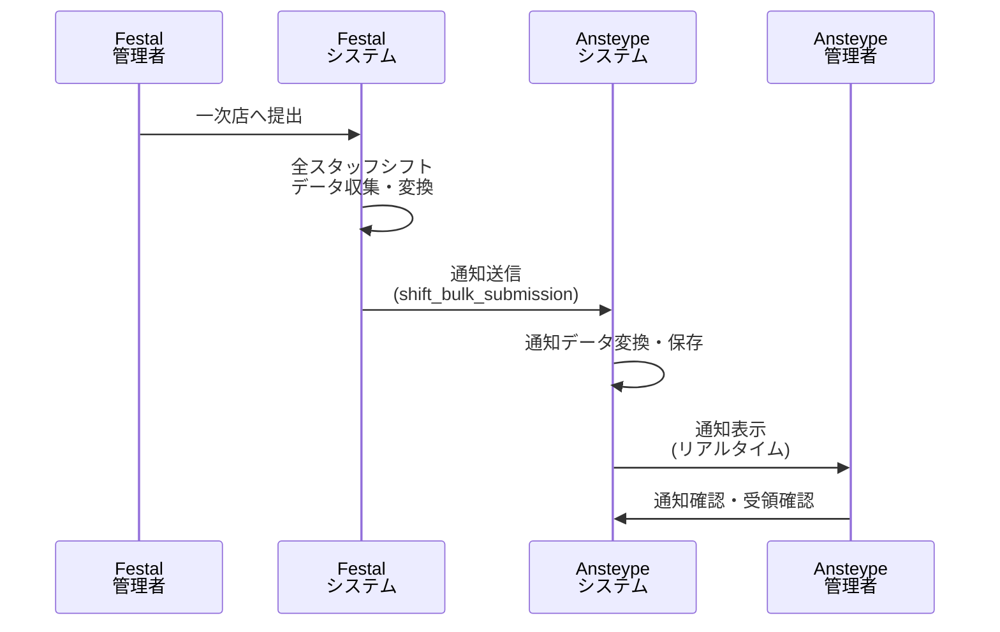
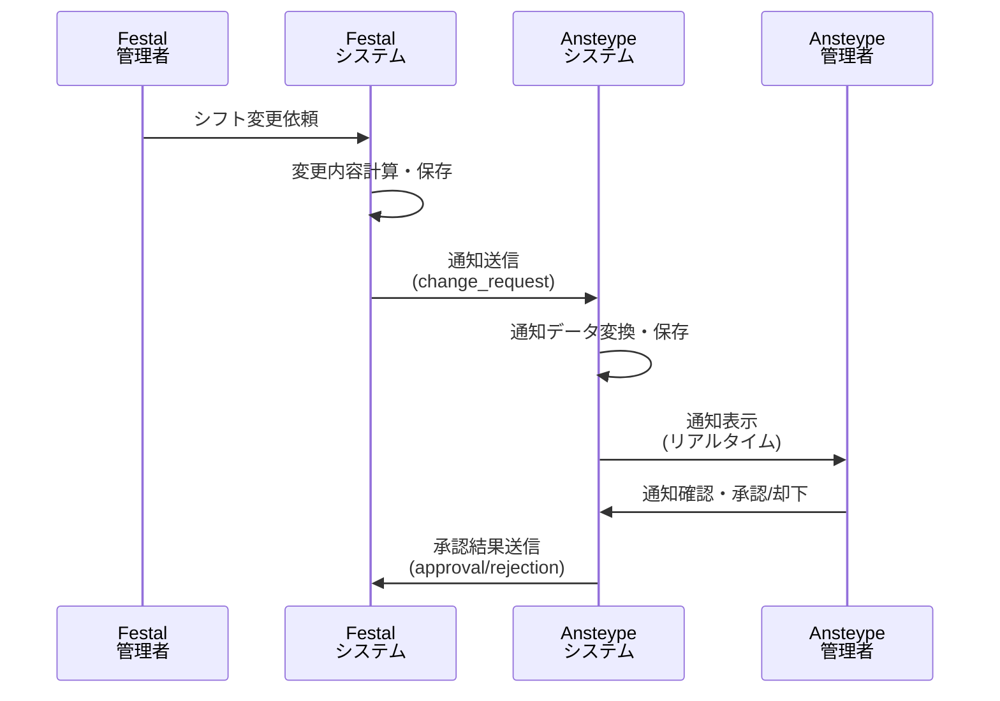

# Ansteype側通知システム仕様書

## 概要

2次店（Festal）システムからAnsteype側システムに送信される通知を管理・表示するための仕様書です。  
2次店システムで発生するシフト提出・シフト変更依頼の内容を適切にAnsteype側で受信・表示することを目的とします。

---

## 1. 通知種別

### 1.1 シフト一括提出通知 (shift_bulk_submission)

**発生タイミング**: 2次店管理者が「一次店へ提出」ボタンを押して、全スタッフのシフトをまとめて提出した時

**通知内容**:
- 通知タイプ: `shift_bulk_submission`
- 提出者情報（2次店管理者）
- 対象年月
- 提出されたスタッフ数
- 提出日時
- 提出されたシフトデータ

**データ構造例**:
```json
{
  "id": "bulk-sub-2025-04-timestamp",
  "type": "shift_bulk_submission",
  "title": "シフト一括提出",
  "message": "Festalから2025年4月のシフトが一括提出されました（23名分）",
  "timestamp": "2025-01-27T15:30:00.000Z",
  "isRead": false,
  "companyName": "Festal",
  "targetAudience": "ansteype",
  "bulkSubmissionData": {
    "id": "bulk-submission-2025-04-festal",
    "companyId": "Festal",
    "yearMonth": "2025-04",
    "submittedAt": "2025-01-27T15:30:00.000Z",
    "submittedBy": "festal_admin",
    "staffCount": 23,
    "shifts": [
      {
        "staffId": "staff123",
        "staffName": "田中太郎",
        "shiftData": [
          {
            "date": "2025-04-01",
            "status": "○",
            "comment": "午前希望"
          }
        ]
      }
    ]
  }
}
```

### 1.2 シフト変更依頼通知 (change_request)

**発生タイミング**: 2次店管理者がシフト変更依頼を送信した時

**通知内容**:
- 通知タイプ: `change_request`
- 依頼者情報（2次店管理者）
- 対象年月
- 変更対象スタッフ一覧
- 変更内容詳細（シフト希望・要望）
- 変更理由
- 依頼日時

**データ構造例**:
```json
{
  "id": "cr-2025-04-timestamp",
  "type": "change_request",
  "title": "シフト変更依頼",
  "message": "Festalから2025年4月のシフト変更依頼（3名、計5件の変更）",
  "timestamp": "2025-01-27T14:45:00.000Z",
  "isRead": false,
  "companyName": "Festal",
  "targetAudience": "ansteype",
  "changeRequestData": {
    "id": "cr-202504-1706365500000",
    "requestDate": "2025-01-27T14:45:00.000Z",
    "targetYear": 2025,
    "targetMonth": 4,
    "staffChanges": [
      {
        "staffId": "staff123",
        "staffName": "田中太郎",
        "changes": [
          {
            "date": "2025-04-15",
            "field": "status",
            "oldValue": "○",
            "newValue": "×"
          },
          {
            "date": "",
            "field": "request",
            "oldValue": "15",
            "newValue": "20"
          }
        ],
        "status": "pending",
        "approverComment": null,
        "approvedAt": null
      },
      {
        "staffId": "staff124",
        "staffName": "佐藤花子",
        "changes": [
          {
            "date": "2025-04-10",
            "field": "status",
            "oldValue": "×",
            "newValue": "○"
          }
        ],
        "status": "approved",
        "approverComment": "承認します",
        "approvedAt": "2025-01-27T16:00:00.000Z"
      }
    ],
    "status": "mixed",
    "totalChanges": 5,
    "approvedCount": 1,
    "rejectedCount": 0,
    "pendingCount": 1,
    "reason": "イベント会場の変更により人員調整が必要"
  }
}
```

---

## 2. 通知データ型定義

### 2.1 基本通知インターフェース

```typescript
interface AnsteyteNotification {
  id: string;
  type: 'shift_bulk_submission' | 'change_request' | 'approval' | 'rejection';
  title: string;
  message: string;
  timestamp: Date;
  isRead: boolean;
  companyName: string; // 常に"Festal"
  targetAudience: 'ansteype'; // Ansteype側は常にansteype
  
  // 追加データ（通知タイプに応じて）
  bulkSubmissionData?: BulkSubmissionData;
  changeRequestData?: ChangeRequestData;
}
```

### 2.2 シフト一括提出データ

```typescript
interface BulkSubmissionData {
  id: string;
  companyId: string; // "Festal"
  yearMonth: string; // "YYYY-MM"形式
  submittedAt: string; // ISO文字列
  submittedBy: string; // 管理者ID
  staffCount: number; // 提出されたスタッフ数
  shifts: StaffShiftData[];
}

interface StaffShiftData {
  staffId: string;
  staffName: string;
  shiftData: ShiftEntry[];
}

interface ShiftEntry {
  date: string; // "YYYY-MM-DD"形式
  status: '○' | '×' | '△';
  comment?: string;
  request?: number; // 要望数
}
```

### 2.3 シフト変更依頼データ

```typescript
interface ChangeRequestData {
  id: string;
  requestDate: string; // ISO文字列
  targetYear: number;
  targetMonth: number;
  staffChanges: StaffChangeData[];
  status: 'pending' | 'approved' | 'mixed' | 'rejected';
  totalChanges: number;
  reason?: string; // 変更理由
  approverComment?: string; // 承認者コメント（依頼全体に対する承認・却下時のコメント）
  approvedCount?: number; // 承認済みスタッフ数
  rejectedCount?: number; // 却下済みスタッフ数
  pendingCount?: number; // 承認待ちスタッフ数
}

interface StaffChangeData {
  staffId: string;
  staffName: string;
  changes: ChangeDetail[];
  status: 'pending' | 'approved' | 'rejected'; // スタッフ単位のステータス
  approvedAt?: string; // 承認・却下日時（ISO文字列）
}

interface ChangeDetail {
  date: string; // "YYYY-MM-DD"形式（要望変更の場合は空文字）
  field: 'status' | 'request';
  oldValue: string; // 数値の場合も文字列として格納
  newValue: string; // 数値の場合も文字列として格納
}
```

---

## 3. 通知受信API仕様

### 3.1 エンドポイント設計

```
POST /api/notifications/receive
POST /api/change-requests/{id}/staff/{staffId}/approve
POST /api/change-requests/{id}/staff/{staffId}/reject  
POST /api/change-requests/{id}/bulk-approve
```

**リクエストボディ**:
```json
{
  "notificationType": "shift_bulk_submission" | "change_request",
  "sourceSystem": "festal",
  "data": {
    // 通知タイプに応じたデータ
  }
}
```

**レスポンス**:
```json
{
  "success": true,
  "notificationId": "generated-notification-id",
  "message": "通知を受信しました"
}
```

### 3.2 データ変換ルール

2次店システムから送信されるデータをAnsteype側の形式に変換する際のルール：

1. **日付形式**: ISO8601形式に統一
2. **会社名**: 常に"Festal"を設定
3. **対象オーディエンス**: 常に"ansteype"を設定
4. **通知ID**: "type-yearmonth-timestamp"の形式で生成
5. **ステータス値**: そのまま保持（'○', '×', '△'）
6. **要望数値**: 整数値を文字列として格納（"15", "20"等）
7. **フィールド名**: requestフィールドに統一（totalRequest/weekendRequestは使用しない）
8. **承認粒度**: スタッフ単位での個別承認・却下が可能
9. **ステータス階層**: 全体ステータスとスタッフ単位ステータスの2階層
10. **一括承認**: pending状態のスタッフのみを対象とした一括承認機能

### 3.1 ステータス体系詳細

#### 変更依頼全体のステータス
- `pending`: 承認待ち（初期状態、全スタッフが未処理）
- `approved`: 承認済み（全スタッフが承認済み）
- `mixed`: 部分承認（承認と却下が混在）
- `rejected`: 却下（全スタッフが却下）

#### スタッフ単位のステータス
- `pending`: 承認待ち（初期状態）
- `approved`: 承認済み
- `rejected`: 却下

#### ステータス判定ロジック
```typescript
function calculateOverallStatus(staffChanges: StaffChangeData[]): string {
  const approved = staffChanges.filter(s => s.status === 'approved').length;
  const rejected = staffChanges.filter(s => s.status === 'rejected').length;
  const pending = staffChanges.filter(s => s.status === 'pending').length;
  const total = staffChanges.length;
  
  if (approved === total) return 'approved'; // 全て承認済み
  if (rejected === total) return 'rejected'; // 全て却下
  if (approved > 0 || rejected > 0) return 'mixed'; // 承認・却下が混在（部分承認）
  return 'pending'; // 全て未処理
}
```

---

## 4. 通知表示画面仕様

### 4.1 通知一覧画面

**画面要素**:
- 通知リスト（時系列順、新しい順）
- 未読バッジ表示
- 通知タイプ別アイコン
- フィルター機能（全て・未読のみ・シフト提出・変更依頼・承認済み）

**表示項目**:
- 通知タイプアイコン
- タイトル・メッセージ
- 送信元（Festal - 管理者）
- 対象年月・スタッフ数
- 受信日時
- 未読/既読状態

### 4.2 シフト一括提出通知表示

通知一覧での基本情報表示のみ。詳細ダイアログは不要。

**表示内容**:
- 🏢 提出元: Festal  
- 📅 対象月: 2025年4月
- 👥 提出人数: 23名
- 🕒 提出日時: 2025-01-27 16:30

**必要な情報のみ**:
- どこの会社から（Festal）
- 何月分のシフトで（2025年4月）
- 何人提出されたか（23名）

### 4.3 シフト変更依頼通知詳細

**表示内容**:
- 依頼日時・変更理由
- 対象年月
- 変更概要（スタッフ数・変更件数）
- スタッフ別変更詳細
  - スタッフ名
  - 変更項目（日付・シフト希望・要望・変更前後の値）
- 承認・却下状況

**操作**:
- 既読マーク
- 承認・却下
- 承認者コメント入力
- 詳細データエクスポート

---

## 5. 通知処理フロー

### 5.1 シフト一括提出時



### 5.2 シフト変更依頼時



---

## 6. 実装における注意点

### 6.1 データ整合性

- 通知IDの重複防止
- 日付形式の統一
- タイムゾーンの適切な処理
- 文字エンコーディングの統一

### 6.2 セキュリティ

- 送信元システムの認証
- データの改ざん防止
- 個人情報の適切な処理
- ログ記録・監査証跡

### 6.3 パフォーマンス

- 通知データの適切な圧縮
- バッチ処理での大量通知対応
- データベースインデックスの最適化
- リアルタイム通知の効率的な配信

### 6.4 運用・保守

- 通知配信失敗時の再送機能
- データバックアップ・復旧
- 監視・アラート機能
- エラーハンドリング・ログ出力

---

## 7. 今後の拡張性

### 7.1 追加通知タイプ

- スタッフ情報変更通知
- 緊急連絡通知
- システムメンテナンス通知

### 7.2 連携システム拡張

- 他の2次店システムとの連携
- 外部カレンダーシステム連携
- 勤怠管理システム連携

### 7.3 機能拡張

- 通知のカテゴリ分類
- 通知のプライオリティ設定
- 自動承認ルール設定
- 通知テンプレート機能

---

**作成日**: 2025年1月27日  
**バージョン**: 1.0  
**対象システム**: Ansteype側通知管理システム